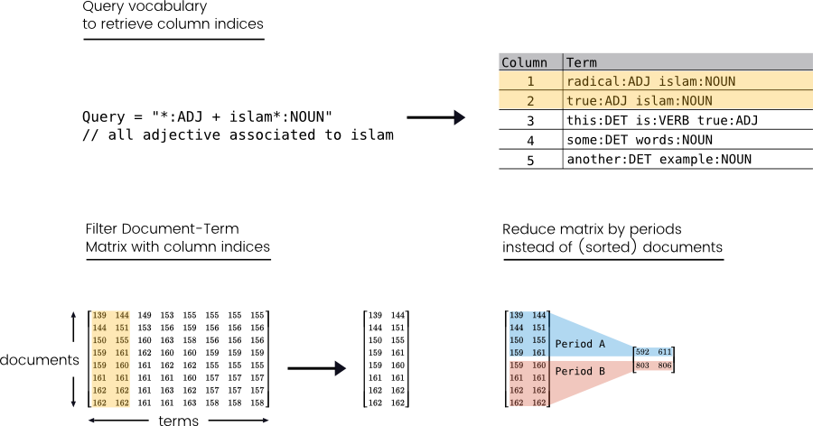
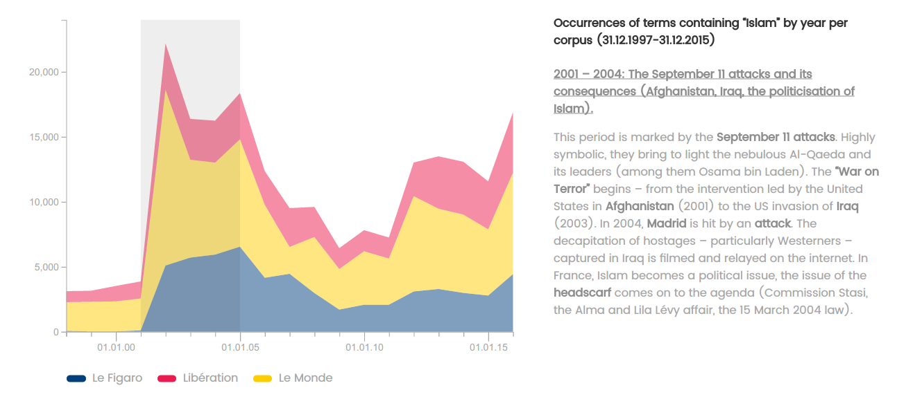
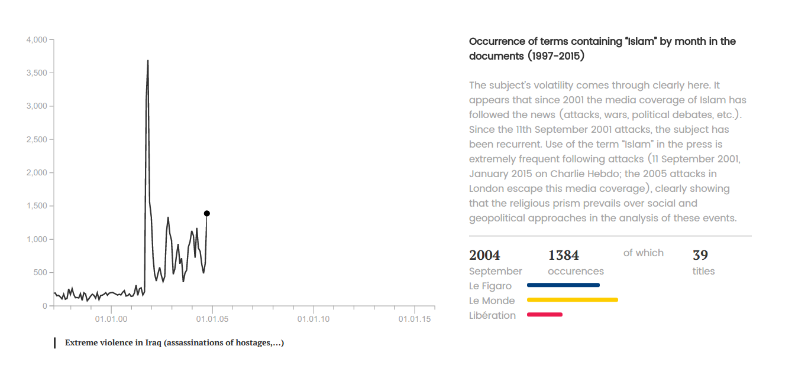
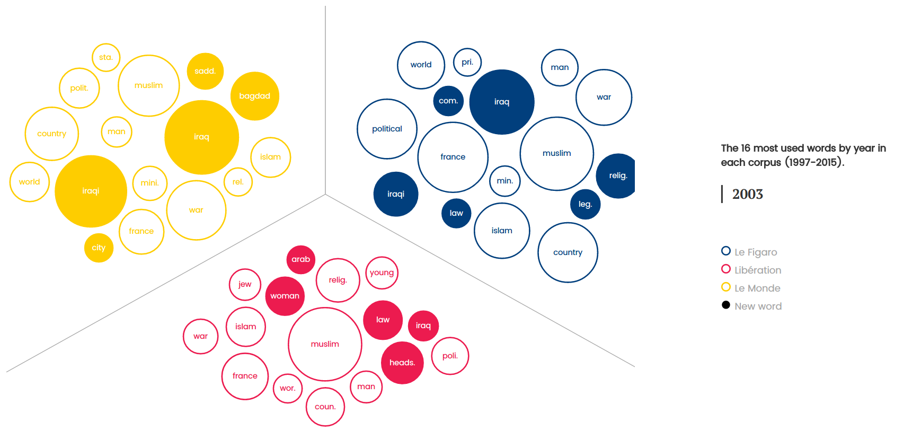
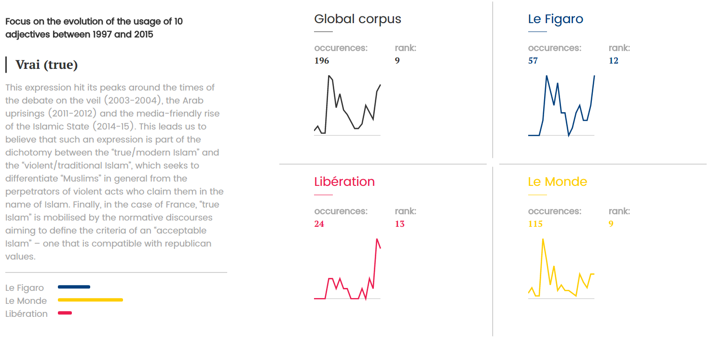

# Islam, media subject

"Islam, media subject" is a collaboration between [Moussa Bourekba][moussa], researcher at Barcelona Center for International Affairs ([CIDOB][cidob]) and associate professor at [Ramon Llul university][url] of Barcelona, and [Skoli][skoli], our young agency created in 2016 by Pierre Bellon (developer), Gauthier Bravais (project manager) and Lucas Piessat (journalist).

## Project's origins
When we created Skoli we were inspired by our experience in the data-driven journalism community. We wanted to help knowledge producers (like researchers, activists, NGOs etc.) spread in society the information they produce by creating innovative web formats.

This project is kind-of a proof-of-concept of what we mean by "innovative web formats". The idea behind it is to quantify how french media are talking about islam because, with time, it became a political - and therefore a journalistic - issue we wanted to question. To do that we chose to quantitatively analyse newspapers articles mentioning terms related to Islam and Muslims.

A small disclaimer: since it was the first project of our agency we were quite limited in terms of time and material resources which limited our ability to explore and gather all the data we wanted. Our time schedule was to spend one month of documentation, research and conception then 2 months of analysis and development.

## Delimiting the perimeter

To quantify the evolution of the Islam subject we chose to focus on newspapers articles that mentioned "islam" or "Muslim", allowing us to also retrieve articles mentioning "islamism", "islamist" and so on. Then we needed to decide what were the newspapers to target so we investigated the most read [daily national newspapers in France][pqn].

From all the newspapers we studied we chose to select only three titles: Le Monde, Le Figaro and Liberation. This small selection can be explained by our will to fit as best as possible with the dominant political spectrum in the press by placing "Libération" on its left, "Le Figaro" on its right and "Le Monde" on its center. This was also an economical and time-saving choice. Indeed, we observed some inequalities of access to articles (old or not) on some newspapers. For instance some didn't have a working search engine to use for articles retrieving so decided to reduce our scope to be able to harvest data in reasonable ways.

The last choice we had to make was the time period to study. At first we wanted to study a period of 20 years (1995-2015) but we were soon forced to reduce our scope because some newspapers articles were not accessible before 1997 so we fixed our period to 1997-2015 hoping to actualize this study later to cover a larger time lapse.

## Architecture

We separated this project into two distinct applications (and code-bases): the backend responsible of harvesting, storing, cleaning and analyzing the data, and the frontend responsible to present the analysis we conducted in collaboration with the researcher.

Concerning the backend, a python-only environment was a natural choice for us for two reasons. First, all the bricks needed for this part were available in python. It guaranteed us a great homogeneity and interoperability between the different components of this part which simplified and accelerated the development. Second, it's a language we're familiar to which let us start without having a big technical barrier to overcome.

The fronted was designed as a static web application fed with exported data from the backend part. It was developed with the AngularJS framework combined with the famous d3js data-visualization library. And again, we chose those technologies because they were familiar to us so we could concentrate on the developing our application and not on learning new techniques.

## Data collection and preparation
Once we delimited our study perimeter and coded the scrapers needed for our various sources we started collecting data and ended up with more than 40.000 articles in our corpus.

We did basic operations to clean it like removing empty articles and cleaning text from artefact like remaining JavaScript code or HTML entities. Then we noticed that newspapers tended to duplicate the publication of articles with identical (or almost identical) content. This could be ignored but we considered that it could give artificial importance to certain terms / words in our analysis compared to other so we decided to remove those duplicates.

Finally, in order to prepare our data for analysis we removed punctuation, lowered the case to improve measurement of the different terms (so "Muslim" and "muslim" can be counted as the same term) and we also removed the different stop words / tool words that didn't bring much information with them.

## Analysis model
This is where things got exciting for us because we finally could start to explore the data and figure out what exactly we could tell thank to them. We experimented many text mining models and libraries but we sticked to a "simple" model because we didn't want to use techniques we didn't totally understood nor produce results we couldn't explain.

As you can see this model depends on two different parts, the part-of-speech tagging which will turn raw texts into tagged texts so that we can see what words are nouns, adjectives, verbs etc. And the [CountVectorizer][countvectorizer] feature took from [sci-kit learn][sklearn], a Python library for machine-learning operations, to create [Document-Term Matrices][dtm], a key element in text-mining analyses.

The basic principle of this matrix is to hold occurrences of terms in all our corpus documents. As shown in the scheme above, matrix's columns indices represents the corpus' terms (which can be a word or a set of words, [n-grams][ngram]) when rows' indices represent the documents. Since we hold in a separate array all references to those documents we could then query this matrix with complex queries.  

For instance we could retrieve all the matrix columns that represented a word containing "islam", then process it with [pandas][pandas] to either just obtain the total occurrences by reducing the matrix to a single value or to a matrix of periods instead of documents (since we had the documents' publishing dates). Also, thanks to part-of-speech tagging we could create even more complex queries like "give me all the terms with a first word like islam associated with an adjective" as illustrated above.

We could then divide our analysis in two parts. First, a quantitative study where we only focused on how the occurrences of "islam" evolved in time. And a more qualitative second part where we wanted to study how journalists were talking about islam and how it evolves in time depending on the newspapers they published in.

## Visualizing the evolution of "islam"
In this part we wanted to have two levels of granularity: annually and monthly. The first level is useful to see the bigger picture and the global trend in our corpus. It helped us to see a global shift around 2001 because of the 9/11 attacks. After this date, "islam" occurrences count reached a level that never came back to what it was before.

The second granularity level (occurrences / months) is more sensible to variations which is helpful to discover "hot" and "cold" moments in the actuality (see the big height that occurred in September of 2001 below).

## The evolution of terms & adjectives

We then studied what were the terms used and visualize that in two way. First with a word-cloud to have a global overview of the most used words on the whole corpus. Then with a bubble chart we created thanks to various parts of d3js (detailed in this [gist][gist]). The idea behind this visualization is to show the evolution of the main annual subjects per newspapers, with new words represented by filled bubbles. For instance we can see below that war in Iraq was one of the main subject of 2003.

The last part of this analysis was focused on visualizing the adjectives associated to Islam. It was one of our main goal because we thought it would reflect the tone used when speaking about Islam. As in the first part, we divided it in two data-visualizations. First, a word-cloud to have a global picture of our corpus. Then with some line charts to see and compare the usage evolution of a small number of adjectives that we wanted to study in depth.

## Conclusion
In conclusion we're happy that we could publish this little study in the way we imagined it but we feel a bit frustrated because we learned about ton of techniques in the process of making this study that we couldn't use because of resources limitations. We hope to continue this study further because we think some parts deserve to be studied deeper. With additional text-mining techniques like topic modeling and some time we would be able to make emerge more precise and qualitative informations that would improve our understanding of how Islam is treated in the media.

Nevertheless this was a rich and profitable collaboration between a researcher and a "data-driven" agency and we're eager to start the next ones, on those subjects or others.

[Visit "Islam, media subject"][iom]

By Pierre Bellon, for Skoli agency.

[gist]:https://gist.github.com/pbellon/4b875d2ab7019c0029b636523b34e074
[moussa]:http://www.cidob.org/en/experts/moussa_bourekba/(language)/eng-US
[cidob]:http://www.cidob.org/en/
[url]:http://www.url.edu/en
[skoli]:http://skoli.fr
[sklearn]:http://scikit-learn.org/stable/index.html
[dtm]: https://en.wikipedia.org/wiki/Document-term_matrix
[skoli]:http://skoli.fr
[ngram]:https://en.wikipedia.org/wiki/N-gram
[pandas]:http://pandas.pydata.org/
[countvectorizer]:http://scikit-learn.org/stable/modules/generated/sklearn.feature_extraction.text.CountVectorizer.html
[pqn]:https://en.wikipedia.org/wiki/Presse_quotidienne_nationale_fran%C3%A7aise
[iom]:http://en.islam-objet-mediatique.fr/
