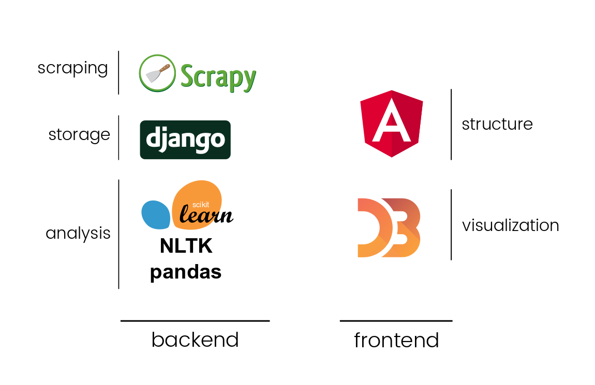
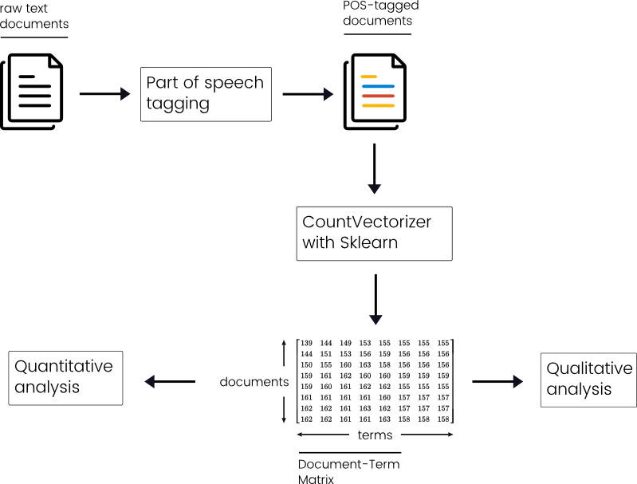

# Islam, media object
"Islam, media object" is a collaboration between Moussa Bourekba, researcher at the Barcelona Center for International Affairs (CIDOB) and associate professor at the Ramon Llul university of Barcelona, and Skoli, our young agency created in 2016 by Pierre Bellon (developer), Gauthier Bravais (project manager) and Lucas Piessat (journalist).

## Project's origins

The idea behind this project was to try to quantify how french medias were talking about islam because <REFORUMULER **we felt this debate was really too passionated and we wanted to bring a new look on how this subject was dealt on the media.**> and to do that we chose to analyse thanks to data analysis newspapers articles mentioning terms related to islam and Muslims.

A small disclaimer: since it was the first project of our agency we were quite limited in terms of time and material ressources which limited our ability to explore & gather all the data we wanted to collect. Our time schedule was to spend one month of documentation, research and conception then 2 months of analysis and development.

## Delimiting the perimeter

To quantify the evolution of the islam subject we chose to focus on newspapers articles that mentioned "islam" or "muslim", allowing us to also retrieve articles mentioning "islamism", "islamist" and so on. Then we needed to decide what were the newspapers to target so we investigated the most read daily newspapers in France daily press (the so called "presse quotidienne nationale - PQN" in French).

From all the newspapers we studied we chose to select only three titles: Le Monde, Le Figaro and Liberation. This small selection can be explained by our will to fit as best as possible to the dominant political spectrum in the press by puting "Libération" to the left of the spectrum, "Le Figaro" to the right and "Le Monde" at its center. This is also an economical and time saving choice. We observed some inequalities in terms of access to articles and some newspapers didn't have a working search engine to use for articles retrieving so we took this drastic choice of keeping only three newspapers.

The last choice we had to make was the time period to study. Indeed at first we wanted to study a of 20 years (1995-2015) but we were soon forced to reduce our scope because some newspapers articles were not accessible before 1997 so we fixed our period to 1997-2015 hoping to actualize this study later to cover a larger time lapse.

## Architecture

We separated this project into two distinct applications (and codebase): the backend responsible of harvesting, storing, cleaning and analyzing the data, and the frontend responsible of the restitution of the analysis conducted in collaboration between the researcher and the agency.

Concerning the backend, a python-only environment was a natural choice for us for two reasons. First, all the bricks needed for this part were available in python. It guaranteed us a great homogeneity and interoperability between the different components of the project which simplified and accelerated the development. Second, it's a language we're familiar to which let us start without having a big technical barrer to climb.

The fronted was designed as a static web application fed with exported data from the backend part. It was developed with the angularJS framework combined with the famous d3js data-visualization library. And again, we chose those technologies because we already were familiar to them so we could concentrate on creating the application and its features and not on learning new techniques. Also, by creating a separated static application we could reduce our costs by hosting it freely on GitHub we convinced us to go for it.

## Data collection and preparation
Once we delimited our study perimeter and coded the scrapers needed for our various sources we started collecting data and ended up with more than 40k articles in our corpus.

We did basic operations to clean it like removing empty articles and cleaning text from artefact like remaining javascript code or HTML entities. Then we noticed that newspapers tended to post articles with identical (or almost identical) content. After a small study it could either be explained as some corrected version or as a duplicated version published in a different edition of the newspapers. This could be ignored but we considered that it could give artificial importance to certain terms / words in our analysis compared to other so we decided to remove those duplicates.

Finally, in order to prepare our data for analysis we did relatively common operations: punctuation removal and lowering the case to improve measurement of the different terms (so "Muslim" and "muslim" can be counted as the same term). We also removed the different stop words / tool words that didn't bring much information with them.

## Analysis & Metrics
This is where thing got exciting for us because we finally could start to explore the data and figure out what exactly we could tell thanks to it. We also experimented many text mining models and libraries but we sticked to a "simple" model because we didn't want to use a model we didn't totally understood and then avoid to use results we couldn't explain.

## Metrics
- occurences count
    - by year / per sub-corpus => 1.1
    - by month / per sub-corpus => 1.2

## Conclusion
- want to go further
    - many subjects could be treated, thanks to topic & dynamic topic modeling
    - other text mining analysis models should be applied to this corpus with new research collaboration
