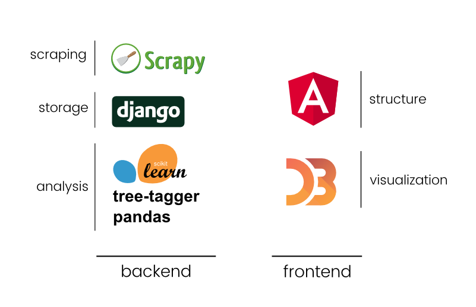
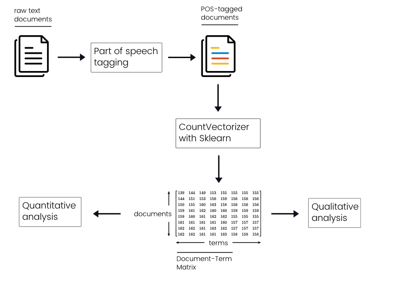

# Islam, media object
"Islam, media object" is a collaboration between [Moussa Bourekba][moussa], researcher at the Barcelona Center for International Affairs ([CIDOB][cidob]) and associate professor at the Ramon Llul university of Barcelona, and Skoli, our young agency created in 2016 by Pierre Bellon (developer), Gauthier Bravais (project manager) and Lucas Piessat (journalist).

## Project's origins

The idea behind this project was to try to quantify how french medias were talking about islam because <REFORUMULER **we felt this debate was really too passionated and we wanted to bring a new look on how this subject was dealt on the media.**> and to do that we chose to analyse thanks to data analysis newspapers articles mentioning terms related to islam and Muslims.

A small disclaimer: since it was the first project of our agency we were quite limited in terms of time and material ressources which limited our ability to explore & gather all the data we wanted to collect. Our time schedule was to spend one month of documentation, research and conception then 2 months of analysis and development.

## Delimiting the perimeter

To quantify the evolution of the islam subject we chose to focus on newspapers articles that mentioned "islam" or "muslim", allowing us to also retrieve articles mentioning "islamism", "islamist" and so on. Then we needed to decide what were the newspapers to target so we investigated the most read daily newspapers in France daily press (the so called "presse quotidienne nationale - PQN" in French).

From all the newspapers we studied we chose to select only three titles: Le Monde, Le Figaro and Liberation. This small selection can be explained by our will to fit as best as possible to the dominant political spectrum in the press by placing "Libération" on its left, "Le Figaro" on its right and "Le Monde" on its center. This is also an economical and time-saving choice. We observed some inequalities in terms of access to articles and some newspapers didn't have a working search engine to use for articles retrieving so we took this drastic choice of keeping only three newspapers.

The last choice we had to make was the time period to study. Indeed at first we wanted to study a of 20 years (1995-2015) but we were soon forced to reduce our scope because some newspapers articles were not accessible before 1997 so we fixed our period to 1997-2015 hoping to actualize this study later to cover a larger time lapse.

## Architecture

We separated this project into two distinct applications (and codebase): the backend responsible of harvesting, storing, cleaning and analyzing the data, and the frontend responsible of the restitution of the analysis conducted in collaboration between the researcher and the agency.

Concerning the backend, a python-only environment was a natural choice for us for two reasons. First, all the bricks needed for this part were available in python. It guaranteed us a great homogeneity and interoperability between the different components of the project which simplified and accelerated the development. Second, it's a language we're familiar to which let us start without having a big technical barrer to climb.

The fronted was designed as a static web application fed with exported data from the backend part. It was developed with the angularJS framework combined with the famous d3js data-visualization library. And again, we chose those technologies because we already were familiar to them so we could concentrate on creating the application and its features and not on learning new techniques.

## Data collection and preparation
Once we delimited our study perimeter and coded the scrapers needed for our various sources we started collecting data and ended up with more than 40k articles in our corpus.

We did basic operations to clean it like removing empty articles and cleaning text from artefact like remaining javascript code or HTML entities. Then we noticed that newspapers tended to post articles with identical (or almost identical) content. This could be ignored but we considered that it could give artificial importance to certain terms / words in our analysis compared to other so we decided to remove those duplicates.

Finally, in order to prepare our data for analysis we removed punctuation, lowered the case to improve measurement of the different terms (so "Muslim" and "muslim" can be counted as the same term) and we also removed the different stop words / tool words that didn't bring much information with them.

## Analysis model
This is where things got exciting for us because we finally could start to explore the data and figure out what exactly we could tell thanks to it. We experimented many text mining models and libraries but we sticked to a "simple" model because we didn't want to use techniques we didn't totally understood and produce results we couldn't explain.

As you can see this model depends on two different parts, the part-of-speech tagging which will turn raw texts into a tagged texts so that we can after that see what words are names, adjectives, verbs etc. And the CountVectorizer feature took from [sci-kit learn][sklearn], a Python library for machine-learning operations, that helps us to create [Document-Term Matrices][dtm], a key element in text-mining analysis.

We then divided our analysis in two parts. First, a quantitative study where we only focused on how the occurrences of "islam" evolved in time. The second part is more qualitative in the sense we wanted to study how journalists were talking about islam and how it evolve in time depending on the newspapers they published in.

## Visualizing our data
In this part we wanted to have two levels of granularity. The first level is the year one. This allowed us to see the bigger picture and the global trend in our corpus and observe a global shift around 2001 because of the 9/11 attacks. At this time "islam" occurrences reached a level that never came back to what it was before.

The second level of granularity was the month. This level allowed us to discover "hot" and "cold" moments in the actuality (see the big height that occurred in September of 2001 bellow).

## The evolution of terms & adjectives

We then studied what were the terms used and visualize that in two way. First we produced a word-cloud to see the most used word on the whole corpus. We also wanted to show the most used words per year and per newspapers in order to have an overview of the main subjects for all our source. For instance we can see bellow that war in Iraq was one of the main subject.

Visualizing the most associated adjectives to islam was one of our main goal because we thought it would reflect the tone used when speaking about islam. As in the most terms used in the corpus we divided it in two data-visualization. One a word-cloud to have to global picture and two a small selection to study in depth some of the adjectives.

## Conclusion
In conclusion we're happy that we could publish this little study in the way we imagined it but we feel a bit frustrated because we learned about tons of techniques in the process of making this study that we couldn't use because of ressources limitation. So now we can see a lot of parts that could be studied deeper with a bit of time and some text-mining techniques (like topic modeling for instance). This would let emerge new informations about this corpus that couldn't be seen with the techniques we used.

Nevertheless this was a rich collaboration between a researcher and a "data-driven" agency and we're eager to start the next ones.

[moussa]:http://www.cidob.org/en/experts/moussa_bourekba/(language)/eng-US
[cidob]:http://www.cidob.org/en/
[sklearn]:http://scikit-learn.org/stable/index.html
[dtm]: https://en.wikipedia.org/wiki/Document-term_matrix
